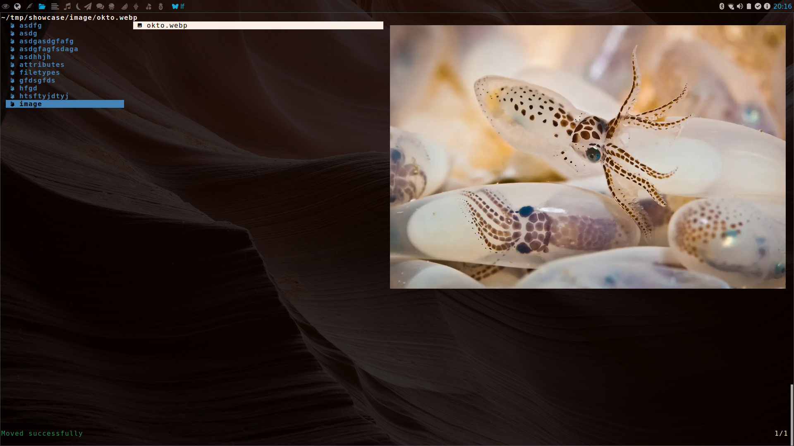

# zephyr
summary of various scripts and dotfiles featuring archlinux + awesome
window manager + lf + urxvt + etc.

## awesome window manager

tiling window manager arranging emacs + terminal + lf + lf on one
screen:

## lf file manager
faster, ranger inspired terminal file manager, featuring:

### file preview with syntax highlighting

### image preview

super fast thumbnail caching via ueberzug:

### colors + icons

ls colors or user defined colors with 256 (or better) color terminals
like urxvt, icons custom via nerd font:
